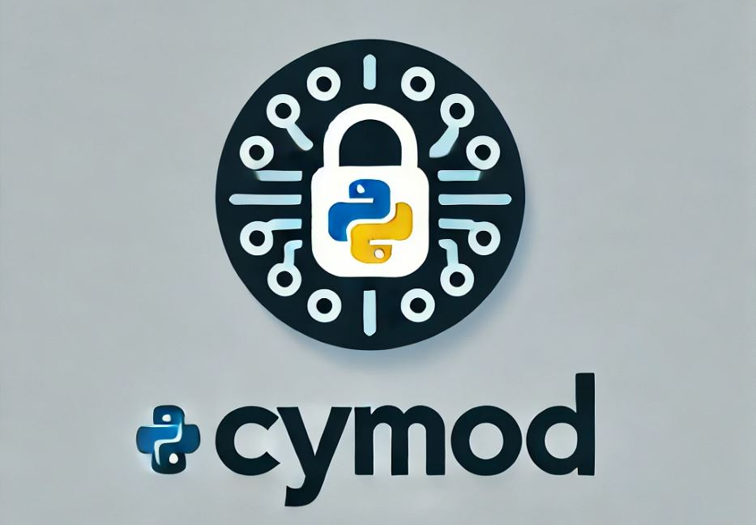

# CyMOD
CyMod is a Python tool that enhances code security by compiling Python code into binary files using Cython. This tool helps protect confidential code when sharing with clients or distributing in production environments by converting Python scripts (.py files) into compiled binaries (.so or .dll files).
# 

## Features
- **Secure Code Sharing**: Compile Python scripts to binaries, making it more challenging to access the source code directly.
- **Compatibility**: Supports both Windows and Linux systems.
- **Easy to Use**: Command-line interface for flexible, straightforward usage.
- **Optimized Performance**: Compiled binaries may offer slight performance improvements over standard Python scripts.

## Getting Started

### Prerequisites
- **Python**: Python 2.x or 3.x (recommended Python 3.x)
- **Cython**: You can install it via pip if not already installed.
```bash
pip install cython
```
- **C++ Compiler**: Ensure a compatible C++ compiler is installed for binary compilation. Compatibility details:
  - **Python 2.6 to 3.2**: [Microsoft Visual C++ Compiler for Python](https://www.microsoft.com/en-in/download/details.aspx?id=7873)
  - **Python 3.3 and 3.4**: [Microsoft Visual Studio 2010](https://www.microsoft.com/en-in/download/details.aspx?id=23507)
  - **Python 3.5 and later**: [Visual Studio 2015+](https://www.kunal-chowdhury.com/2015/07/download-visualstudio-2015.html#topic2)

### Installation
Clone the CyMod repository and navigate to its directory:
```bash
git clone https://github.com/username/CyMod.git
cd CyMod
```

### Running the code

1.Fork the code into your local directory<br/>
2.Decide which python version you want to use and check if corresponding support of c++ compiler is with you or not<br/>

In case of Windows, Following support is needed for different python versions:<br/>
1. Python 2.6 to 3.2 Check [Link1](https://www.microsoft.com/en-in/download/details.aspx?id=7873) [Link2](https://www.microsoft.com/en-us/download/details.aspx?id=44266)<br/>
2. Python 3.3, 3.4 Check [Link3](https://www.microsoft.com/en-in/download/details.aspx?id=23507)<br/>
3. Python 3.5 and Later Check [Link4](https://www.kunal-chowdhury.com/2015/07/download-visualstudio-2015.html#topic2)<br/>

While installing, Keep in mind to select this:  

<p align="left">
  
</p>

4. Make a Copy of your folder which you want to convert into compiled binary

5. Pass the path of your copied project like this:
```
python cyMOD.py <path_of_package>
```
#### Examples
Download samp_proj folder, and you can use it for a sample run
```
1. python cyMOD.py C:\Users\BIG1KOR\Desktop\samp_proj
2. python cyMOD.py C:\Users\BIG1KOR\Desktop\samp_proj -K=True
3. python cyMOD.py C:\Users\BIG1KOR\Desktop\samp_proj -K=True -A=__init__.py,main.py
```
#### For help type
```
python cyMOD.py -h
```
## Usage Flow

CyMod follows these basic steps:
1. **Identify Files**: Scans the specified folder for `.py` files.
2. **Filter Files**: Excludes specified files, such as `__init__.py` or `main.py`.
3. **Generate Setup File**: Creates a `setup.py` file required for Cython compilation.
4. **Compile to Binary**: Compiles Python files to binary using the C++ compiler.

## Sample Folder Structure
```plaintext
sample_project/
├── main.py
├── __init__.py
├── module1.py
└── module2.py
```

Running CyMod will produce the following structure (if `keep` is set to `False`):
```plaintext
sample_project/
├── main.c
├── __init__.pyc/.so
├── module1.pyc/.so
└── module2.pyc/.so
```

## Security Considerations
CyMod increases code security by obfuscating Python scripts, but please note:
- **Platform-Specific Binaries**: The compiled binaries are tailored to the specific Python version and operating system.
- **Reverse Engineering**: While binaries provide code obfuscation, they are not entirely immune to reverse engineering.

## Pros and Cons
### Pros
1. **Enhanced Code Security**: Obfuscates code by compiling to binaries.
2. **Cross-Platform**: Works on both Windows and Linux systems.
3. **Slight Performance Boost**: Executing compiled code may be faster than raw `.py` files.

### Cons
1. **Platform-Specific**: Binaries are specific to the operating system and Python version.
2. **C++ Compiler Required**: Compilation requires the setup of a compatible C++ compiler.
3. **Not Completely Secure**: Binaries may still be reverse-engineered.

## Troubleshooting
**Common Issues and Solutions**:
1. **C++ Compiler Error**: Ensure the correct C++ compiler version is installed and configured.
2. **File Not Found Error**: Verify the folder path and ensure `.py` files are in place.
3. **Setup File Issues**: If `setup.py` fails to generate, check folder permissions and confirm Cython is installed.

## Contributing
We welcome contributions to improve CyMod! Feel free to open an issue or submit a pull request.

## License
This project is licensed under the GNU General Public License v3.0. See the [LICENSE](LICENSE) file for details.
